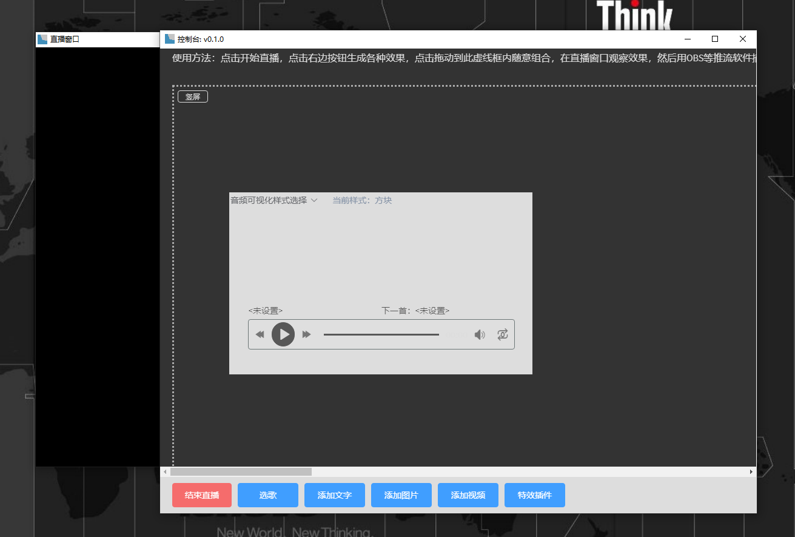
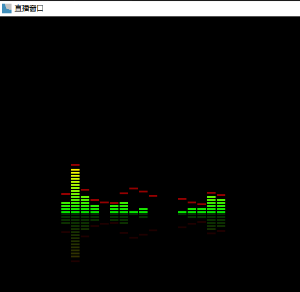

# Stage使用

Stage是一款提供直播数字内容、特效和互动的辅助软件，它可以帮你单独提取出网上早已存在的各种2D、3D、图片、音频、视频内容，以及各种视觉特效，甚至各种小游戏，供你随心所欲的组合，让观众参与互动，实现你心目中想要的直播效果。

# 使用界面

stage打开后有两个独立的窗口，一个是黑色背景的无头直播窗口，展示直播效果，另一个是控制台窗口，供主播在后台根据需要实时选择展示各种物料。

注意：目前Stage并不直接提供推流功能，所以需要OBS这类推流软件配合，在OBS来源中直接捕获Stage的直播窗口即可。

# 基本操作

使用时，只需要选择想要的直播元素，拖动到虚线内，直播窗口就可以看到想要的效果。

直播窗口为16：10的720P大小,可以设定为横屏或竖屏。

Stage内置了最基本的放歌，添加文字，添加照片和视频元素，你只需要点击控制台下面的相应按钮就可以产生对应的效果。

这些最基本的功能，有些直接使用OBS也可以做到，stage胜在可以借助HTML+CSS技术提供更丰富的视觉表达，比如，同样是播放音乐，stage可以方便给出视觉效果：

# 使用插件

互联网是一个巨大的内容宝库，提供了无数可以用于直播的数字资源，很多效果都不可能硬编程内置到stage里，所以stage使用一个插件系统来提供更多的特效或功能。

任何人都可以按约定的规则开发自己想要的插件，插件有一个单独的仓库，有能力的用户开发出开源的插件后可以提交到这个仓库供大家在线免费使用。

插件开发非常简单，任何初级前端开发者都可以把现有的网页效果转换成插件，详情请访问：https://github.com/hongbing2017/stageplugin

# 下载

Stage已经完全开源，大家可以去这里下载：https://github.com/hongbing2017/stage/releases

Stage已经开通了知乎直播，有使用问题或者想看直接效果的可以询问主播，当然主播不一定随时在线。

